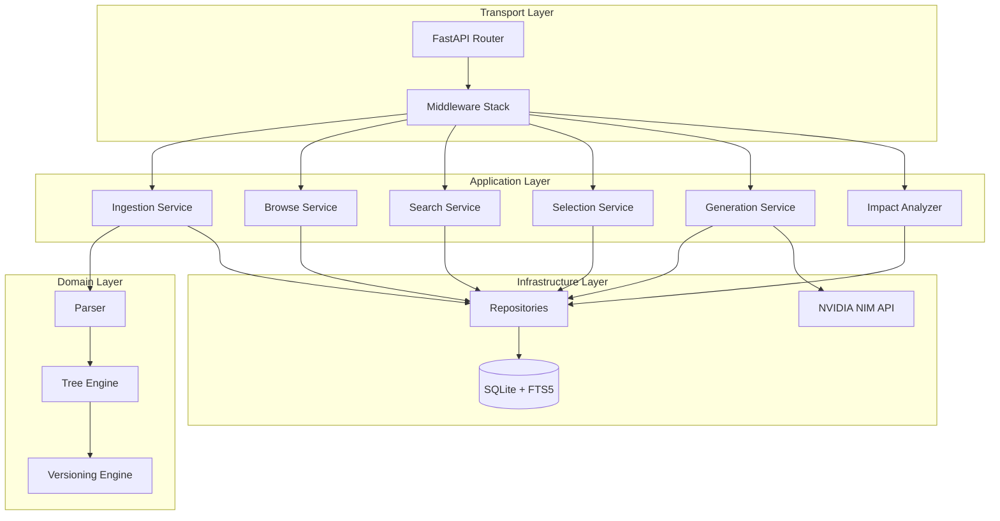
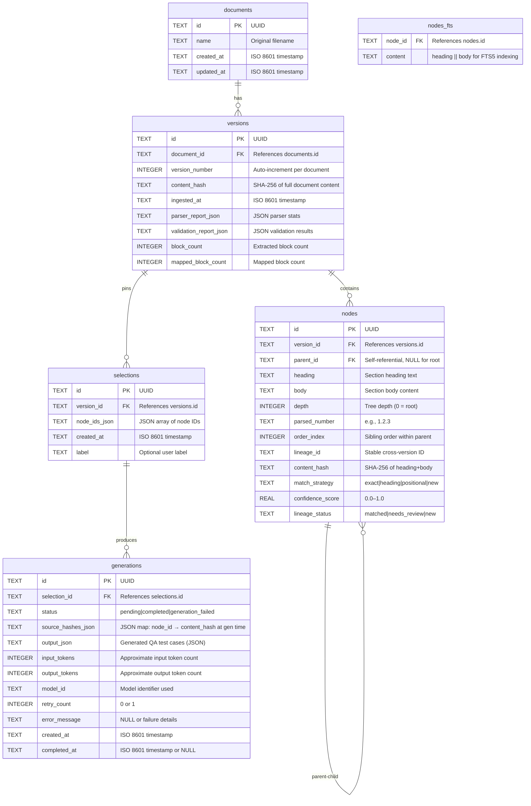
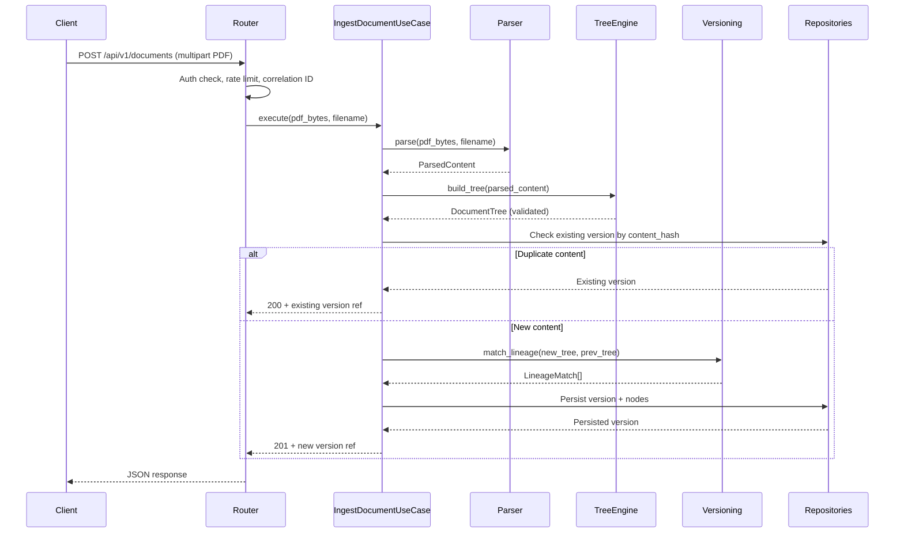
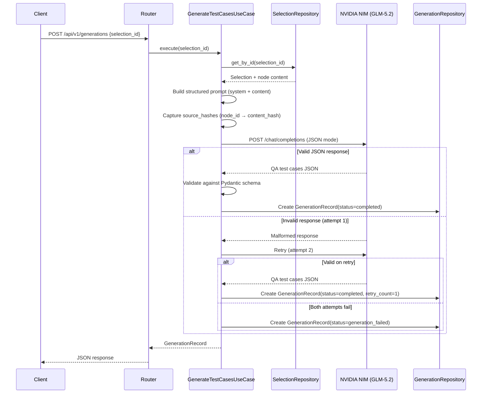
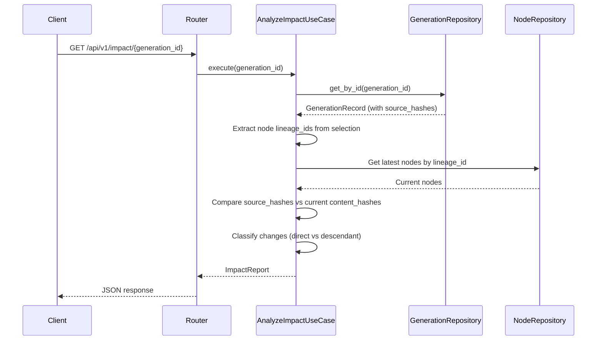

# Design Document: CT200 QA Traceability System

## Overview

The CT200 QA Traceability System is a backend service that transforms CT200 technical PDF documents into a versioned, searchable document tree and generates traceable QA test cases using NVIDIA NIM (GLM-5.2). The system tracks document evolution across versions, detects when generated test cases become stale due to content changes, and provides full observability.

The architecture follows Clean Architecture principles with clear separation between HTTP transport, application services, domain logic, and infrastructure adapters. All cross-cutting concerns (authentication, rate limiting, logging, metrics) are handled via middleware and dependency injection.

### Key Design Goals

- **Correctness**: Round-trip parsing, idempotent ingestion, validated tree structures
- **Traceability**: Every generation links back to exact document version and node content
- **Observability**: Structured JSON logs with correlation IDs, Prometheus metrics
- **Resilience**: Retry with backoff for LLM calls, fail-closed parsing, configurable timeouts
- **Security**: Auth guard, rate limiting, prompt-injection hygiene, magic-byte validation

## Architecture

### High-Level Architecture



### Clean Architecture Layers

| Layer | Responsibility | Dependencies |
|-------|---------------|--------------|
| **Transport** | HTTP routing, request/response serialization, middleware | Application |
| **Application** | Use case orchestration, workflow coordination | Domain |
| **Domain** | Business rules, entities, value objects, interfaces | None |
| **Infrastructure** | Database, external APIs, file I/O | Domain (implements interfaces) |

### Project Folder Structure

```
ct200-qa-traceability/
├── alembic/
│   ├── versions/
│   ├── env.py
│   └── alembic.ini
├── src/
│   └── ct200/
│       ├── __init__.py
│       ├── main.py                    # FastAPI app factory
│       ├── config.py                  # Pydantic Settings (env-based)
│       ├── dependencies.py            # DI container / provider functions
│       │
│       ├── domain/
│       │   ├── __init__.py
│       │   ├── entities.py            # Document, Version, Node, Selection, Generation
│       │   ├── value_objects.py       # ContentHash, LineageID, ConfidenceScore
│       │   ├── exceptions.py          # Domain-specific exceptions
│       │   ├── interfaces/
│       │   │   ├── __init__.py
│       │   │   ├── parser.py          # IParser protocol
│       │   │   ├── tree_engine.py     # ITreeEngine protocol
│       │   │   ├── versioning.py      # IVersioningEngine protocol
│       │   │   ├── repositories.py    # IDocumentRepo, IVersionRepo, etc.
│       │   │   ├── search.py          # ISearchService protocol
│       │   │   ├── generation.py      # IGenerationService protocol
│       │   │   └── impact.py          # IImpactAnalyzer protocol
│       │   └── events.py             # Domain events (optional)
│       │
│       ├── application/
│       │   ├── __init__.py
│       │   ├── ingestion.py           # IngestDocumentUseCase
│       │   ├── browse.py              # BrowseTreeUseCase
│       │   ├── search.py              # SearchNodesUseCase
│       │   ├── selection.py           # CreateSelectionUseCase
│       │   ├── generation.py          # GenerateTestCasesUseCase
│       │   ├── impact.py              # AnalyzeImpactUseCase
│       │   └── versioning.py          # DiffVersionsUseCase
│       │
│       ├── infrastructure/
│       │   ├── __init__.py
│       │   ├── database/
│       │   │   ├── __init__.py
│       │   │   ├── engine.py          # SQLAlchemy engine + session factory
│       │   │   ├── models.py          # ORM mapped classes
│       │   │   └── repositories/
│       │   │       ├── __init__.py
│       │   │       ├── document.py    # DocumentRepository
│       │   │       ├── version.py     # VersionRepository
│       │   │       ├── node.py        # NodeRepository
│       │   │       ├── selection.py   # SelectionRepository
│       │   │       └── generation.py  # GenerationRepository
│       │   ├── parser/
│       │   │   ├── __init__.py
│       │   │   ├── pymupdf_parser.py  # PyMuPDF implementation
│       │   │   └── markdown_renderer.py
│       │   ├── tree/
│       │   │   ├── __init__.py
│       │   │   └── tree_engine.py     # Tree construction + validation
│       │   ├── versioning/
│       │   │   ├── __init__.py
│       │   │   └── lineage_matcher.py # Three-tier matching strategy
│       │   ├── search/
│       │   │   ├── __init__.py
│       │   │   └── fts5_search.py     # FTS5 search implementation
│       │   ├── generation/
│       │   │   ├── __init__.py
│       │   │   ├── nim_client.py      # NVIDIA NIM HTTP client
│       │   │   └── prompt_templates.py
│       │   └── impact/
│       │       ├── __init__.py
│       │       └── analyzer.py        # Staleness detection
│       │
│       └── transport/
│           ├── __init__.py
│           ├── middleware/
│           │   ├── __init__.py
│           │   ├── correlation.py     # Correlation ID injection
│           │   ├── auth.py            # Auth guard middleware
│           │   ├── rate_limit.py      # slowapi rate limiter
│           │   ├── error_handler.py   # Global exception handler
│           │   └── metrics.py         # Prometheus instrumentation
│           ├── routers/
│           │   ├── __init__.py
│           │   ├── health.py          # /health, /ready, /metrics
│           │   ├── ingestion.py       # POST /api/v1/documents
│           │   ├── browse.py          # GET /api/v1/documents/..., tree
│           │   ├── search.py          # GET /api/v1/search
│           │   ├── selection.py       # POST/GET /api/v1/selections
│           │   ├── generation.py      # POST/GET /api/v1/generations
│           │   └── impact.py          # GET /api/v1/impact/...
│           └── schemas/
│               ├── __init__.py
│               ├── requests.py        # Pydantic request models
│               ├── responses.py       # Pydantic response models
│               └── shared.py          # Shared schemas (pagination, errors)
│
├── tests/
│   ├── conftest.py
│   ├── unit/
│   │   ├── domain/
│   │   ├── application/
│   │   └── infrastructure/
│   ├── integration/
│   ├── property/                      # Property-based tests
│   └── hardening/                     # Timeout, size-limit, error tests
│
├── docs/
│   ├── APPROACH.md
│   ├── architecture.md
│   ├── adr/                           # Architecture Decision Records
│   └── known-limitations.md
│
├── Dockerfile
├── docker-compose.yml
├── pyproject.toml
├── .env.example
├── .github/workflows/ci.yml
└── README.md
```

## Components and Interfaces

### Domain Interfaces (Protocols)

```python
# domain/interfaces/parser.py
from typing import Protocol
from ct200.domain.entities import ParsedContent, ParserReport, ValidationReport

class IParser(Protocol):
    async def parse(self, pdf_bytes: bytes, filename: str) -> ParsedContent:
        """Parse PDF bytes into structured content."""
        ...

    def render_markdown(self, content: ParsedContent) -> str:
        """Render parsed content back to markdown."""
        ...
```

```python
# domain/interfaces/tree_engine.py
from typing import Protocol
from ct200.domain.entities import ParsedContent, DocumentTree, DocumentNode

class ITreeEngine(Protocol):
    def build_tree(self, content: ParsedContent) -> DocumentTree:
        """Construct validated document tree from parsed content."""
        ...

    def validate(self, tree: DocumentTree) -> list[str]:
        """Return validation errors (empty = valid)."""
        ...
```

```python
# domain/interfaces/versioning.py
from typing import Protocol
from ct200.domain.entities import DocumentTree, VersionDiff, LineageMatch
from ct200.domain.value_objects import ConfidenceScore

class IVersioningEngine(Protocol):
    def match_lineage(
        self, new_tree: DocumentTree, prev_tree: DocumentTree | None
    ) -> list[LineageMatch]:
        """Match nodes across versions using three-tier strategy."""
        ...

    def compute_diff(
        self, version_a_id: str, version_b_id: str
    ) -> VersionDiff:
        """Compute lightweight diff between two versions."""
        ...
```

```python
# domain/interfaces/repositories.py
from typing import Protocol
from ct200.domain.entities import Document, Version, DocumentNode, Selection, GenerationRecord

class IDocumentRepository(Protocol):
    async def get_by_id(self, doc_id: str) -> Document | None: ...
    async def create(self, document: Document) -> Document: ...
    async def list_all(self) -> list[Document]: ...

class IVersionRepository(Protocol):
    async def get_by_id(self, version_id: str) -> Version | None: ...
    async def get_by_content_hash(self, doc_id: str, content_hash: str) -> Version | None: ...
    async def create(self, version: Version) -> Version: ...
    async def get_latest(self, doc_id: str) -> Version | None: ...

class INodeRepository(Protocol):
    async def get_by_id(self, node_id: str) -> DocumentNode | None: ...
    async def get_tree(self, version_id: str) -> list[DocumentNode]: ...
    async def bulk_create(self, nodes: list[DocumentNode]) -> None: ...
    async def search_fts(self, query: str, version_id: str, limit: int, offset: int) -> list[DocumentNode]: ...

class ISelectionRepository(Protocol):
    async def get_by_id(self, selection_id: str) -> Selection | None: ...
    async def create(self, selection: Selection) -> Selection: ...
    async def list_by_version(self, version_id: str) -> list[Selection]: ...

class IGenerationRepository(Protocol):
    async def get_by_id(self, gen_id: str) -> GenerationRecord | None: ...
    async def create(self, record: GenerationRecord) -> GenerationRecord: ...
    async def list_by_selection(self, selection_id: str) -> list[GenerationRecord]: ...
    async def list_by_document(self, doc_id: str) -> list[GenerationRecord]: ...
```

```python
# domain/interfaces/generation.py
from typing import Protocol
from ct200.domain.entities import Selection, GenerationRecord

class IGenerationService(Protocol):
    async def generate(self, selection: Selection) -> GenerationRecord:
        """Generate QA test cases for the given selection."""
        ...
```

```python
# domain/interfaces/impact.py
from typing import Protocol
from ct200.domain.entities import ImpactReport

class IImpactAnalyzer(Protocol):
    async def analyze(self, generation_id: str) -> ImpactReport:
        """Analyze staleness for a specific generation."""
        ...

    async def analyze_document(self, doc_id: str) -> list[ImpactReport]:
        """Analyze staleness for all generations of a document."""
        ...
```

### Service Layer Components

| Service | Responsibility | Key Dependencies |
|---------|---------------|-----------------|
| `IngestDocumentUseCase` | Orchestrates PDF upload → parse → tree build → version → persist | IParser, ITreeEngine, IVersioningEngine, Repositories |
| `BrowseTreeUseCase` | Retrieves document tree, subtrees, and single nodes | INodeRepository, IVersionRepository |
| `SearchNodesUseCase` | FTS5 search with pagination and metadata | INodeRepository |
| `CreateSelectionUseCase` | Creates immutable version-pinned selections | ISelectionRepository, INodeRepository |
| `GenerateTestCasesUseCase` | Orchestrates selection → prompt → NIM call → validate → persist | IGenerationService, ISelectionRepository |
| `AnalyzeImpactUseCase` | Detects stale generations via hash comparison | IImpactAnalyzer, IGenerationRepository |
| `DiffVersionsUseCase` | Computes and formats version diffs | IVersioningEngine |

### Middleware Stack (applied in order)

1. **CorrelationMiddleware** — Injects `X-Correlation-ID` header into request context, binds to structlog
2. **AuthGuardMiddleware** — Validates bearer tokens, skips health endpoints
3. **RateLimitMiddleware** — slowapi enforcement per-client on ingestion/generation
4. **MetricsMiddleware** — Prometheus counter/histogram instrumentation
5. **ErrorHandlerMiddleware** — Catches unhandled exceptions, returns structured JSON errors

## Data Models

### Database Schema



### SQLAlchemy ORM Models (Abbreviated)

```python
# infrastructure/database/models.py
from sqlalchemy import Column, Text, Integer, Float, ForeignKey, Index
from sqlalchemy.orm import DeclarativeBase, relationship

class Base(DeclarativeBase):
    pass

class DocumentModel(Base):
    __tablename__ = "documents"
    id = Column(Text, primary_key=True)
    name = Column(Text, nullable=False)
    created_at = Column(Text, nullable=False)
    updated_at = Column(Text, nullable=False)
    versions = relationship("VersionModel", back_populates="document")

class VersionModel(Base):
    __tablename__ = "versions"
    id = Column(Text, primary_key=True)
    document_id = Column(Text, ForeignKey("documents.id"), nullable=False)
    version_number = Column(Integer, nullable=False)
    content_hash = Column(Text, nullable=False)
    ingested_at = Column(Text, nullable=False)
    parser_report_json = Column(Text)
    validation_report_json = Column(Text)
    block_count = Column(Integer)
    mapped_block_count = Column(Integer)
    document = relationship("DocumentModel", back_populates="versions")
    nodes = relationship("NodeModel", back_populates="version")

    __table_args__ = (
        Index("ix_versions_doc_hash", "document_id", "content_hash", unique=True),
    )

class NodeModel(Base):
    __tablename__ = "nodes"
    id = Column(Text, primary_key=True)
    version_id = Column(Text, ForeignKey("versions.id"), nullable=False)
    parent_id = Column(Text, ForeignKey("nodes.id"), nullable=True)
    heading = Column(Text, nullable=False, default="")
    body = Column(Text, nullable=False, default="")
    depth = Column(Integer, nullable=False)
    parsed_number = Column(Text, default="")
    order_index = Column(Integer, nullable=False)
    lineage_id = Column(Text, nullable=False)
    content_hash = Column(Text, nullable=False)
    match_strategy = Column(Text, default="new")
    confidence_score = Column(Float, default=1.0)
    lineage_status = Column(Text, default="new")
    version = relationship("VersionModel", back_populates="nodes")
    children = relationship("NodeModel", back_populates="parent", foreign_keys=[parent_id])
    parent = relationship("NodeModel", remote_side=[id], back_populates="children")

    __table_args__ = (
        Index("ix_nodes_version", "version_id"),
        Index("ix_nodes_lineage", "lineage_id"),
        Index("ix_nodes_parent_order", "parent_id", "order_index", unique=True),
    )

class SelectionModel(Base):
    __tablename__ = "selections"
    id = Column(Text, primary_key=True)
    version_id = Column(Text, ForeignKey("versions.id"), nullable=False)
    node_ids_json = Column(Text, nullable=False)
    created_at = Column(Text, nullable=False)
    label = Column(Text, default="")

class GenerationModel(Base):
    __tablename__ = "generations"
    id = Column(Text, primary_key=True)
    selection_id = Column(Text, ForeignKey("selections.id"), nullable=False)
    status = Column(Text, nullable=False, default="pending")
    source_hashes_json = Column(Text, nullable=False)
    output_json = Column(Text, nullable=True)
    input_tokens = Column(Integer, default=0)
    output_tokens = Column(Integer, default=0)
    model_id = Column(Text, nullable=False)
    retry_count = Column(Integer, default=0)
    error_message = Column(Text, nullable=True)
    created_at = Column(Text, nullable=False)
    completed_at = Column(Text, nullable=True)
```

### Domain Entities (Pydantic v2)

```python
# domain/entities.py
from pydantic import BaseModel, Field
from enum import Enum

class MatchStrategy(str, Enum):
    EXACT = "exact"
    HEADING = "heading"
    POSITIONAL = "positional"
    NEW = "new"

class LineageStatus(str, Enum):
    MATCHED = "matched"
    NEEDS_REVIEW = "needs_review"
    NEW = "new"

class GenerationStatus(str, Enum):
    PENDING = "pending"
    COMPLETED = "completed"
    FAILED = "generation_failed"

class DocumentNode(BaseModel):
    id: str
    version_id: str
    parent_id: str | None = None
    heading: str = ""
    body: str = ""
    depth: int
    parsed_number: str = ""
    order_index: int
    lineage_id: str
    content_hash: str
    match_strategy: MatchStrategy = MatchStrategy.NEW
    confidence_score: float = Field(default=1.0, ge=0.0, le=1.0)
    lineage_status: LineageStatus = LineageStatus.NEW
    children: list["DocumentNode"] = Field(default_factory=list)

class LineageMatch(BaseModel):
    node_id: str
    lineage_id: str
    strategy: MatchStrategy
    confidence: float = Field(ge=0.0, le=1.0)
    status: LineageStatus

class ImpactReport(BaseModel):
    generation_id: str
    is_stale: bool
    changed_nodes: list[str]  # node lineage_ids
    changes: list[NodeChange]
    reasons: list[str]

class NodeChange(BaseModel):
    lineage_id: str
    change_type: str  # "direct" | "descendant"
    old_hash: str
    new_hash: str
    diff_summary: str
```

### Key Data Flows

#### Ingest Pipeline



#### Generation Pipeline



#### Staleness Detection




## Correctness Properties

*A property is a characteristic or behavior that should hold true across all valid executions of a system — essentially, a formal statement about what the system should do. Properties serve as the bridge between human-readable specifications and machine-verifiable correctness guarantees.*

### Property 1: Round-Trip Parsing (CP-2.1)

*For any* valid document tree produced by the Parser, rendering that tree to markdown and re-parsing the markdown SHALL produce a structurally equivalent document tree — same node count, same heading hierarchy, and same content ordering.

**Validates: Requirements 2.11, 2.4**

### Property 2: Reconciliation Completeness (CP-2.2)

*For any* parsed document, the sum of successfully mapped blocks plus explicitly unmapped blocks SHALL equal the total number of extracted blocks — zero blocks vanish unexplained.

**Validates: Requirements 2.6**

### Property 3: Parser Determinism (CP-2.3)

*For any* valid PDF input, parsing the same file N times SHALL produce byte-identical markdown output on every run.

**Validates: Requirements 2.1, 2.4**

### Property 4: Tree Integrity (CP-3.1)

*For any* document tree produced by the Tree_Engine: (a) every non-root node has exactly one parent, (b) no cycles exist, (c) each node's depth equals its parent's depth plus one, and (d) sibling order indices form a contiguous zero-based sequence within each parent.

**Validates: Requirements 3.7, 3.8, 3.9, 3.10**

### Property 5: Hash Determinism (CP-3.2)

*For any* two Document_Nodes with identical heading and body content, their computed Content_Hash values SHALL be equal; conversely, any change to heading or body SHALL produce a different hash with overwhelming probability.

**Validates: Requirements 3.12**

### Property 6: Ordering Preservation (CP-3.3)

*For any* input document, the pre-order traversal of the constructed tree SHALL reflect the original document ordering — order indices are assigned by source-document sequence, not by parsed number values.

**Validates: Requirements 3.4**

### Property 7: Round-Trip Persistence Fidelity (CP-4.1)

*For any* valid document tree, persisting the tree to the database and reloading it SHALL produce a structurally equal tree with identical topology, node content, sibling ordering, depth values, and Content_Hash values.

**Validates: Requirements 4.4**

### Property 8: Ingestion Idempotency (CP-4.2)

*For any* document with content hash H, ingesting the same content a second time SHALL result in exactly one version record in the database — the duplicate is detected and skipped.

**Validates: Requirements 4.3**

### Property 9: Persistence Atomicity (CP-4.3)

*For any* failed persistence operation (constraint violation, storage error, or mid-transaction crash), the database state SHALL be identical to the state before the operation began — no partial commits.

**Validates: Requirements 4.5, 4.6**

### Property 10: Strategy Ordering (CP-5.1)

*For any* pair of document versions, the Versioning_Engine SHALL attempt lineage matching in strict order: exact Content_Hash match first, then parent-lineage plus heading match, then positional fallback — no strategy is skipped or reordered.

**Validates: Requirements 5.1**

### Property 11: Confidence Threshold Enforcement (CP-5.2)

*For any* lineage match whose Confidence_Score is below the configured threshold, the match status SHALL be `needs_review` — never silently auto-accepted.

**Validates: Requirements 5.3**

### Property 12: Version Immutability (CP-5.3)

*For any* previously persisted document version, no field SHALL be mutated after a subsequent version is created — previous versions are append-only historical records.

**Validates: Requirements 5.4**

### Property 13: Versioning Determinism (CP-5.4)

*For any* pair of document versions, running lineage matching repeatedly SHALL produce identical match results (same lineage_ids, same strategies, same confidence scores) on every execution.

**Validates: Requirements 5.4**

### Property 14: Pagination Consistency (CP-6.1)

*For any* paginated browse or search query, iterating through all pages SHALL return every matching node exactly once — no duplicates and no omissions.

**Validates: Requirements 6.6**

### Property 15: Search Relevance (CP-6.2)

*For any* FTS5 search query that matches at least one node's heading or body content, the search results SHALL contain that node.

**Validates: Requirements 6.4**

### Property 16: Version Scoping (CP-6.3)

*For any* browse or search request scoped to a specific document version, the results SHALL contain only nodes belonging to that version — no cross-version leakage.

**Validates: Requirements 6.1**

### Property 17: Selection Immutability (CP-7.1)

*For any* persisted selection, subsequent attempts to mutate the node references or version reference SHALL be rejected — selections are write-once.

**Validates: Requirements 7.1**

### Property 18: No Silent Drops (CP-7.2)

*For any* generation attempt (success, schema failure, network failure, or timeout), exactly one Generation_Record SHALL be persisted with a terminal status — either `completed` or `generation_failed`. No attempt ends without a record.

**Validates: Requirements 7.5, 7.7, 7.8**

### Property 19: Rate Compliance (CP-7.3)

*For any* sliding 60-second window, the Generation_Service SHALL never issue more than the configured maximum number of requests to NVIDIA NIM (default 40 per minute).

**Validates: Requirements 7.9**

### Property 20: Prompt Separation (CP-7.4)

*For any* generated prompt sent to NVIDIA NIM, the prompt template SHALL structurally separate system instructions from document content such that document content cannot alter or escape the system instruction section.

**Validates: Requirements 7.3**

### Property 21: Generation Record Immutability (CP-8.1)

*For any* staleness check performed on a Generation_Record, the record's stored source-hashes, output, and status SHALL remain byte-identical before and after the check — impact analysis is a read-only computed view.

**Validates: Requirements 8.6**

### Property 22: Staleness Completeness (CP-8.2)

*For any* stale generation, every node whose Content_Hash differs from the stored source-hash (or whose Lineage_ID is missing from the latest version) SHALL be reported in the impact response — no stale node is omitted.

**Validates: Requirements 8.3, 8.4**

### Property 23: Staleness Correctness (CP-8.3)

*For any* generation, IF all source-hashes match the current lineage hashes THEN the status SHALL be `current`; IF any source-hash differs or a lineage node is missing THEN the status SHALL be `stale`.

**Validates: Requirements 8.2, 8.3**

### Property 24: Correlation Consistency (CP-11.1)

*For any* single HTTP request, all structured log entries produced during that request lifecycle SHALL carry the same Correlation_ID value, and that value SHALL be unique across concurrent requests.

**Validates: Requirements 11.1, 11.2**

### Property 25: No Content Leakage (CP-11.2)

*For any* log entry emitted at INFO level or below, the entry SHALL NOT contain raw document node body text or PDF binary content.

**Validates: Requirements 11.3**

### Property 26: Readiness Accuracy (CP-11.3)

*For any* call to GET /ready, the endpoint SHALL return HTTP 503 if and only if the database is unreachable — never 200 when the DB is down, and never 503 when the DB is healthy.

**Validates: Requirements 11.5**

### Property 27: Auth Enforcement (CP-12.1)

*For any* HTTP request to a non-exempt endpoint (all except /health, /ready, /metrics, /docs) that lacks valid authentication credentials, the Auth_Guard SHALL return HTTP 401 — never a successful response.

**Validates: Requirements 12.1**

### Property 28: Rate Limit Enforcement (CP-12.2)

*For any* client that exceeds the configured per-client rate limit within the enforcement window, the next request SHALL receive HTTP 429 with a Retry-After header.

**Validates: Requirements 12.2, 12.3**

### Property 29: No Secret Leakage (CP-12.3)

*For any* file tracked in source control, that file SHALL NOT contain API keys, tokens, or credential values — secrets are loaded exclusively from environment variables at runtime.

**Validates: Requirements 12.5**

## Error Handling

### Structured Error Response Format

All error responses follow a consistent JSON envelope:

```json
{
  "error": {
    "code": "DOMAIN_ERROR_CODE",
    "message": "Human-readable description",
    "details": {},
    "correlation_id": "request-correlation-id",
    "timestamp": "2024-01-01T00:00:00Z"
  }
}
```

### Domain Exception Hierarchy

```python
class CT200Error(Exception):
    """Base exception for all domain errors."""
    code: str
    status_code: int = 500
    message: str

class ValidationError(CT200Error):
    """Input validation failures."""
    status_code = 422

class NotFoundError(CT200Error):
    """Requested resource does not exist."""
    status_code = 404

class ConflictError(CT200Error):
    """Operation conflicts with current state (e.g., duplicate)."""
    status_code = 409

class ParsingError(CT200Error):
    """PDF parsing failures."""
    status_code = 422

class TreeValidationError(CT200Error):
    """Tree construction or validation failures."""
    status_code = 422

class GenerationError(CT200Error):
    """QA generation failures (LLM unreachable, schema invalid)."""
    status_code = 502

class TimeoutError(CT200Error):
    """Operation exceeded configured wall-clock timeout."""
    status_code = 504

class AuthenticationError(CT200Error):
    """Missing or invalid credentials."""
    status_code = 401

class RateLimitError(CT200Error):
    """Client exceeded rate limit."""
    status_code = 429

class PersistenceError(CT200Error):
    """Database constraint violation or connection failure."""
    status_code = 500
```

### HTTP Status Code Mapping

| Scenario | Status Code | Error Code |
|----------|-------------|------------|
| Missing/invalid auth token | 401 | `AUTH_REQUIRED` |
| Rate limit exceeded | 429 | `RATE_LIMIT_EXCEEDED` |
| File too large (>50 MB) | 413 | `FILE_TOO_LARGE` |
| Invalid PDF (magic-byte fail) | 422 | `INVALID_FILE_FORMAT` |
| Pathological input (depth/size) | 422 | `PATHOLOGICAL_INPUT` |
| Parse timeout (>120s) | 504 | `PARSE_TIMEOUT` |
| Tree validation failed | 422 | `TREE_VALIDATION_FAILED` |
| Node/document not found | 404 | `RESOURCE_NOT_FOUND` |
| Search query too short | 422 | `QUERY_TOO_SHORT` |
| Selection references invalid nodes | 422 | `INVALID_SELECTION` |
| Duplicate content (idempotent) | 200 | (not an error — returns existing) |
| NIM unreachable | 502 | `GENERATION_UPSTREAM_ERROR` |
| NIM timeout (>60s) | 504 | `GENERATION_TIMEOUT` |
| NIM schema validation failed (both attempts) | 502 | `GENERATION_SCHEMA_ERROR` |
| DB constraint violation | 500 | `PERSISTENCE_ERROR` |
| DB connection loss | 503 | `SERVICE_UNAVAILABLE` |

### Error Handling by Subsystem

#### Parser Errors

| Condition | Behavior |
|-----------|----------|
| File exceeds 50 MB | Reject immediately with `FILE_TOO_LARGE`, do not attempt parsing |
| Magic-byte mismatch | Reject immediately with `INVALID_FILE_FORMAT` |
| Wall-clock timeout (120s) | Terminate parsing task, return `PARSE_TIMEOUT` |
| Pathological input (depth > 20 or page > 50 MB) | Fail closed with `PATHOLOGICAL_INPUT`, do not produce partial output |
| Unexpected PyMuPDF error | Log at ERROR with stack trace, return `PARSING_ERROR` with safe message |

#### Generation Errors

| Condition | Behavior |
|-----------|----------|
| NIM unreachable (connection refused/DNS failure) | Create `generation_failed` record with error details, return 502 |
| NIM hard timeout (60s) | Cancel request via `tenacity` timeout, create `generation_failed` record, return 504 |
| NIM returns invalid JSON (attempt 1) | Retry once with same prompt |
| NIM returns invalid JSON (attempt 2) | Create `generation_failed` record with both validation error messages |
| NIM rate limit hit (HTTP 429 from NIM) | Respect Retry-After, queue or fail with `GENERATION_UPSTREAM_ERROR` |

#### Database Errors

| Condition | Behavior |
|-----------|----------|
| Unique constraint violation (duplicate version) | Return existing resource (idempotent behavior) |
| Foreign key violation | Roll back transaction, return `PERSISTENCE_ERROR` with constraint details |
| Connection pool exhausted | Return 503 `SERVICE_UNAVAILABLE`, log at WARN |
| Mid-transaction failure | Roll back entire transaction atomically, return `PERSISTENCE_ERROR` |
| WAL checkpoint failure | Log at WARN, do not surface to client (non-critical) |

#### Auth and Rate Limiting Errors

| Condition | Behavior |
|-----------|----------|
| Missing Authorization header | Return 401 with `AUTH_REQUIRED` |
| Invalid/expired token | Return 401 with `AUTH_REQUIRED` (do not distinguish to prevent enumeration) |
| Per-client rate limit exceeded | Return 429 with `Retry-After` header indicating seconds until reset |
| Global NIM rate limit approaching | Internally queue or delay, transparent to client unless timeout triggers |

### Retry and Resilience Patterns

```python
# Generation retry configuration (tenacity)
@retry(
    stop=stop_after_attempt(2),
    wait=wait_none(),  # Immediate retry for schema failures
    retry=retry_if_exception_type(SchemaValidationError),
    before_sleep=log_retry_attempt,
)
async def _call_nim(self, prompt: StructuredPrompt) -> GenerationOutput: ...

# NIM client timeout configuration
NIM_CONNECT_TIMEOUT = 10  # seconds
NIM_READ_TIMEOUT = 60     # seconds (hard timeout)
```

## Testing Strategy

### Overview

The testing strategy employs a dual approach: **property-based tests** verify universal correctness invariants across generated inputs, while **example-based tests** cover specific scenarios, edge cases, and integration points. The minimum test suite contains 80+ test cases: 30 unit, 20 integration, 10 hardening, plus property-based tests.

### Property-Based Testing (Hypothesis)

**Library**: [Hypothesis](https://hypothesis.readthedocs.io/) for Python

**Configuration**: Each property test runs a minimum of 100 iterations (`@settings(max_examples=100)`)

**Tag format**: Each property test includes a comment referencing its design property:
```python
# Feature: ct200-qa-traceability, Property 1: Round-trip parsing — For any valid document tree,
# rendering to markdown and re-parsing produces a structurally equivalent tree.
```

**Properties to implement as PBT:**

| Property | Test File | Generator Strategy |
|----------|-----------|-------------------|
| CP-2.1 Round-Trip Parsing | `tests/property/test_parser_properties.py` | Generate random `ParsedContent` trees with varying headings, depths, tables, lists |
| CP-2.2 Reconciliation Completeness | `tests/property/test_parser_properties.py` | Generate parsed documents, verify block arithmetic |
| CP-2.3 Parser Determinism | `tests/property/test_parser_properties.py` | Generate random valid PDFs (via fixture), parse N times |
| CP-3.1 Tree Integrity | `tests/property/test_tree_properties.py` | Generate random `ParsedContent` with varying depth/width, build trees, check all 4 invariants |
| CP-3.2 Hash Determinism | `tests/property/test_tree_properties.py` | Generate random `(heading, body)` pairs, verify hash equality for same content |
| CP-3.3 Ordering Preservation | `tests/property/test_tree_properties.py` | Generate documents with shuffled numbering, verify pre-order matches source order |
| CP-4.1 Round-Trip Persistence | `tests/property/test_persistence_properties.py` | Generate random valid trees, persist and reload, compare |
| CP-4.2 Ingestion Idempotency | `tests/property/test_persistence_properties.py` | Generate random content, ingest twice, verify single version |
| CP-4.3 Persistence Atomicity | `tests/property/test_persistence_properties.py` | Inject failures at various transaction points, verify rollback |
| CP-5.1 Strategy Ordering | `tests/property/test_versioning_properties.py` | Generate tree pairs with overlapping content, trace strategy calls |
| CP-5.2 Confidence Threshold | `tests/property/test_versioning_properties.py` | Generate matches with random scores around threshold |
| CP-5.3 Version Immutability | `tests/property/test_versioning_properties.py` | Generate version sequences, snapshot and compare |
| CP-5.4 Versioning Determinism | `tests/property/test_versioning_properties.py` | Generate tree pairs, run matching 3x, compare results |
| CP-6.1 Pagination Consistency | `tests/property/test_search_properties.py` | Generate datasets of various sizes, paginate through all |
| CP-6.2 Search Relevance | `tests/property/test_search_properties.py` | Generate content with known keywords, search, verify inclusion |
| CP-6.3 Version Scoping | `tests/property/test_search_properties.py` | Generate multi-version documents, query by version, verify no leakage |
| CP-7.1 Selection Immutability | `tests/property/test_selection_properties.py` | Create selections, attempt mutations, verify rejection |
| CP-7.2 No Silent Drops | `tests/property/test_generation_properties.py` | Generate various failure scenarios (mocked NIM), verify record always exists |
| CP-7.3 Rate Compliance | `tests/property/test_generation_properties.py` | Simulate rapid requests, count NIM calls per window |
| CP-7.4 Prompt Separation | `tests/property/test_generation_properties.py` | Generate selections with adversarial content (injection attempts), verify structure |
| CP-8.1 Generation Record Immutability | `tests/property/test_impact_properties.py` | Snapshot records, run analysis, compare |
| CP-8.2 Staleness Completeness | `tests/property/test_impact_properties.py` | Generate records with random hash changes, verify all reported |
| CP-8.3 Staleness Correctness | `tests/property/test_impact_properties.py` | Generate matching and mismatching hash sets, verify status |
| CP-11.1 Correlation Consistency | `tests/property/test_observability_properties.py` | Generate random requests, capture logs, verify ID consistency |
| CP-11.2 No Content Leakage | `tests/property/test_observability_properties.py` | Process documents with distinctive content markers, scan logs |
| CP-12.1 Auth Enforcement | `tests/property/test_security_properties.py` | Enumerate all non-exempt routes, test without auth |
| CP-12.2 Rate Limit Enforcement | `tests/property/test_security_properties.py` | Generate request bursts at/above threshold, verify 429 |

### Unit Tests (30+ tests)

Focus areas:
- **Domain logic**: Entity creation, value object validation, hash computation
- **Tree Engine**: Tree construction, validation rules, depth assignment, disambiguation
- **Versioning Engine**: Three-tier matching logic (each strategy independently), confidence scoring
- **Prompt Templates**: Template rendering, structural separation verification
- **Impact Analyzer**: Hash comparison logic, change classification (direct vs descendant)

Example test cases:
```python
# tests/unit/domain/test_tree_engine.py
def test_skipped_heading_level_assigns_correct_parent(): ...
def test_duplicate_headings_disambiguated_by_order_index(): ...
def test_numbered_list_items_not_promoted_to_nodes(): ...
def test_tree_rejects_cycle(): ...
def test_tree_rejects_missing_parent(): ...
def test_content_hash_deterministic(): ...
```

### Integration Tests (20+ tests)

Focus areas:
- **API endpoints**: Full HTTP round-trip through FastAPI test client
- **Database round-trips**: Persist → query → verify via SQLAlchemy
- **FTS5 search**: Index construction, query execution, relevance ranking
- **Middleware stack**: Auth rejection, rate limiting, correlation ID propagation
- **Health endpoints**: /health, /ready (with DB up/down), /metrics

Example test cases:
```python
# tests/integration/test_ingestion_api.py
async def test_ingest_pdf_creates_version(): ...
async def test_ingest_duplicate_returns_existing(): ...
async def test_ingest_invalid_pdf_returns_422(): ...
async def test_ingest_oversized_file_returns_413(): ...

# tests/integration/test_generation_api.py
async def test_generate_success_creates_record(): ...
async def test_generate_timeout_creates_failed_record(): ...
```

### Hardening Tests (10+ tests)

Focus areas:
- **Malformed input**: Corrupt PDFs, truncated files, zero-byte uploads
- **Timeout enforcement**: Slow parsing, slow NIM responses
- **Concurrency**: Parallel ingestion of same document (idempotency under race)
- **Resource limits**: Pathological nesting depth, oversized pages
- **Injection attempts**: Prompt injection via document content, SQL injection via search

Example test cases:
```python
# tests/hardening/test_parser_hardening.py
def test_corrupt_pdf_returns_error_not_crash(): ...
def test_pathological_nesting_fails_closed(): ...
def test_single_page_exceeding_50mb_fails_closed(): ...

# tests/hardening/test_generation_hardening.py
def test_prompt_injection_via_document_content(): ...
def test_concurrent_generation_requests(): ...
```

### Benchmark Tests (Latency Regression Gates)

```python
# tests/benchmarks/test_latency.py
import pytest

@pytest.mark.benchmark
def test_parse_10_page_pdf_under_2s(benchmark, sample_10_page_pdf): ...

@pytest.mark.benchmark
def test_node_retrieval_under_100ms(benchmark, populated_db): ...

@pytest.mark.benchmark
def test_fts5_search_under_300ms(benchmark, index_with_500_nodes): ...

@pytest.mark.benchmark
def test_full_ingest_180_page_under_30s(benchmark, ct200_pdf): ...
```

CI enforces p95 thresholds — exceeding any threshold fails the build.

### Test Fixtures and Factories

```python
# tests/conftest.py
@pytest.fixture
def db_session():
    """In-memory SQLite with WAL mode and FTS5 for test isolation."""
    ...

@pytest.fixture
def sample_parsed_content():
    """Factory for generating ParsedContent with configurable depth/width."""
    ...

@pytest.fixture
def populated_tree(db_session):
    """Pre-built document tree with 50+ nodes across 4 depth levels."""
    ...

@pytest.fixture
def nim_mock():
    """httpx mock for NVIDIA NIM responses (success, failure, timeout)."""
    ...
```

**Hypothesis custom strategies:**
```python
# tests/property/strategies.py
from hypothesis import strategies as st

@st.composite
def document_nodes(draw):
    """Generate valid DocumentNode instances with random content."""
    ...

@st.composite
def document_trees(draw, max_depth=5, max_width=8):
    """Generate valid hierarchical trees satisfying all integrity invariants."""
    ...

@st.composite
def version_pairs(draw):
    """Generate two related document trees simulating version evolution."""
    ...
```

### Mock Patterns for NVIDIA NIM

```python
# tests/mocks/nim_mock.py
class NIMClientMock:
    """Configurable mock for NVIDIA NIM GLM-5.2 responses."""

    def __init__(self, responses: list[NIMResponse | Exception]):
        self._responses = iter(responses)

    async def generate(self, prompt: StructuredPrompt) -> NIMResponse:
        response = next(self._responses)
        if isinstance(response, Exception):
            raise response
        return response

# Usage in tests:
nim_mock = NIMClientMock([
    NIMResponse(content=valid_qa_json, input_tokens=500, output_tokens=200),
])

# Failure scenarios:
nim_timeout = NIMClientMock([TimeoutError("NIM request timed out")])
nim_bad_json = NIMClientMock([
    NIMResponse(content="not valid json", ...),  # First attempt fails
    NIMResponse(content=valid_qa_json, ...),     # Retry succeeds
])
```

### Test Execution

```bash
# Run all tests
pytest tests/ -v

# Run only property-based tests
pytest tests/property/ -v --hypothesis-show-statistics

# Run only benchmarks
pytest tests/benchmarks/ -v --benchmark-only

# Run hardening tests
pytest tests/hardening/ -v

# CI command (all tests + coverage)
pytest tests/ --cov=src/ct200 --cov-report=xml --cov-fail-under=85
```
