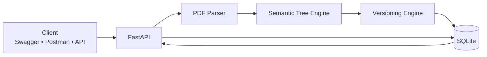
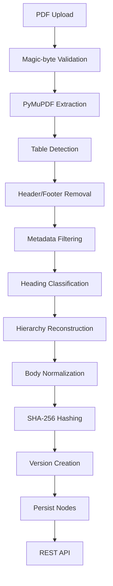
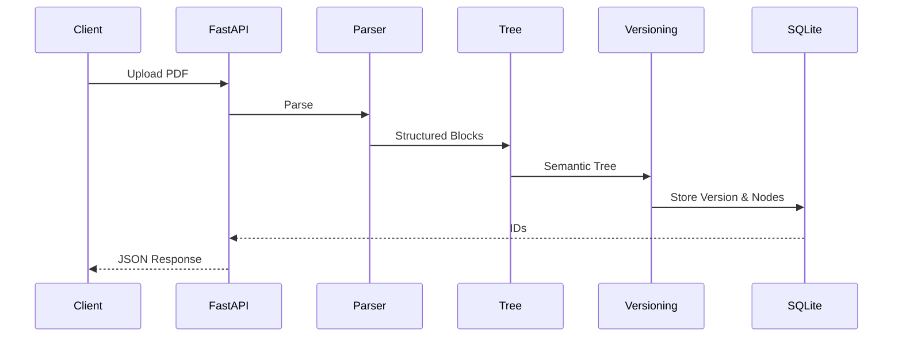
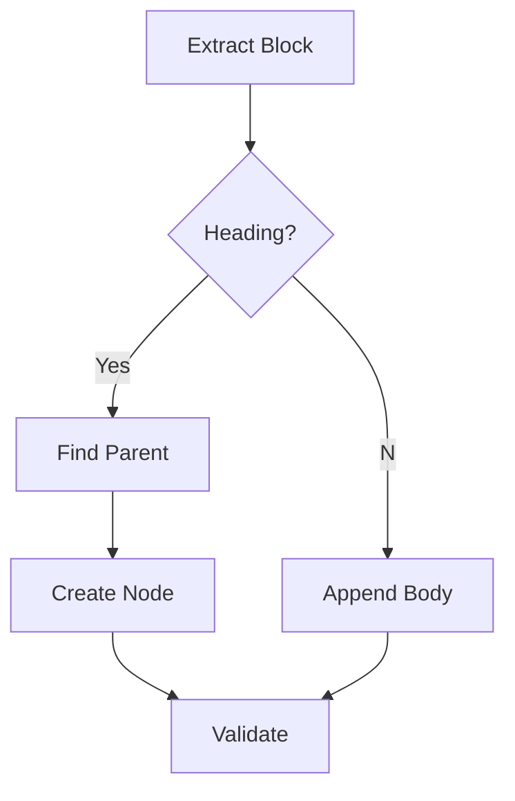
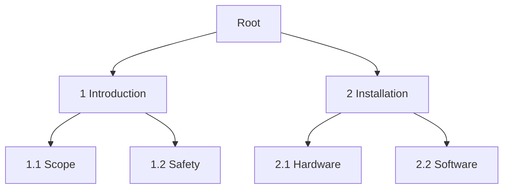
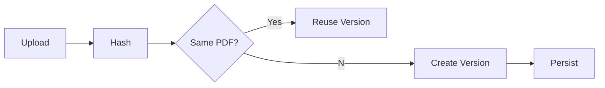
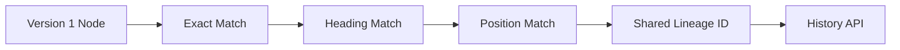
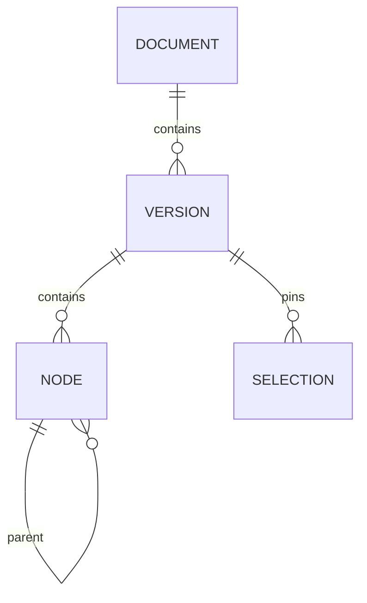
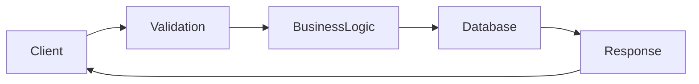
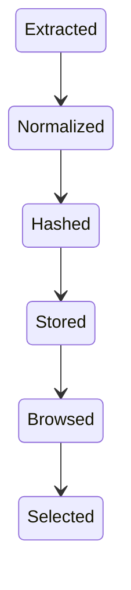

# CT200 QA Traceability — System Architecture

> A deterministic backend that transforms technical PDF manuals into versioned semantic trees for QA traceability.

---

## Architecture Overview



---

## Complete Processing Pipeline



---

## Request Lifecycle



---

## Component Mind Map

```text
CT200
│
├── FastAPI
│   ├── Upload
│   ├── Browse
│   ├── History
│   └── Selections
│
├── Parser
│   ├── Validation
│   ├── Layout
│   ├── Typography
│   ├── Tables
│   ├── Metadata
│   └── Diagnostics
│
├── Tree Engine
│   ├── Heading Detection
│   ├── Parent Resolution
│   ├── Depth Validation
│   └── Ordering
│
├── Versioning
│   ├── Hashes
│   ├── Lineage
│   └── Versions
│
└── SQLite
```

---

## Parser Decision Flow



---

## Semantic Tree



---

## Version Lifecycle



---

## Lineage Flow



---

## Database Model



---

## API Architecture



---

## Node Lifecycle



---

## Responsibilities

| Component | Responsibility |
|------------|----------------|
| FastAPI | HTTP API |
| Parser | PDF extraction |
| Tree Engine | Semantic hierarchy |
| Versioning | Lineage & versions |
| SQLite | Persistence |
| Schemas | Validation |

---

## Design Principles

- Deterministic parsing
- No fabricated structure
- Stable semantic hashes
- Immutable versions
- Append-only history
- Source-order persistence
- Conservative recovery
- Lightweight architecture

---

## Current Scope

```text
✓ PDF ingestion
✓ Semantic parsing
✓ Versioning
✓ Browse API
✓ Node history
✓ Immutable selections

Future:
• Search
• OCR
• Generation
• Authentication
• Rate limiting
```

---

## Future Architecture


---

## Implementation Details

### FastAPI Application (`src/ct200/main.py`)

The application is a single-file FastAPI instance with five routes. No middleware stack, no dependency injection framework. Routes call the parser and database layer directly.

Routes use synchronous `def` for database-touching endpoints (FastAPI runs these in a thread pool automatically) and `async def` only for the ingestion route which needs `await file.read()`.

### Parser Pipeline (`src/ct200/parser/`)

| Module | Purpose |
|--------|---------|
| `pymupdf_parser.py` | PDF extraction with PyMuPDF, magic-byte validation, timeout, multi-column detection |
| `header_footer_stripper.py` | Detects and removes repeated text in page margins |
| `tree_engine.py` | Multi-signal heading detection, hierarchy construction, body normalization |
| `markdown_renderer.py` | Deterministic markdown reconstruction from parsed blocks |
| `reporting.py` | Extraction statistics and content reconciliation counts |

The parser runs in a thread (`asyncio.to_thread`) with a configurable wall-clock timeout. Pathological inputs (oversized pages, deep nesting) are rejected before extraction begins.

### Heading Detection (Multi-Signal)

A block is promoted to a heading node only when multiple signals agree:

1. Matches section-number regex (`^\d+(\.\d+)*\s+`)
2. Remainder text is short (< 80 chars) OR classified as HEADING by font analysis
3. Does NOT end with sentence punctuation (period, comma, semicolon with long text)
4. Is NOT a bare number without content

This prevents numbered list items like "3. Turn off the device." from becoming hierarchy nodes.

### Tree Construction

Depth is always `parent.depth + 1`, never the raw dot-count from section numbering. The engine uses dot-count only to locate the nearest valid ancestor via stack popping, then assigns structural depth relative to the found parent.

Cover-page content is classified using page-number and metadata signals rather than blanket-skipped.

### Dependency Injection (`get_session`)

`database.py` exposes a `get_session(database_url)` function that returns a SQLAlchemy `Session`. In production, routes call this with the module-level `DATABASE_URL`. In tests, `conftest.py` monkey-patches both `ct200.database.get_session` and `ct200.main.get_session` to return sessions bound to a temporary file-based SQLite database.

### Why Temporary File Instead of `:memory:` in Tests

SQLite's `:memory:` creates a separate database per connection. Since FastAPI routes open their own sessions internally, each route handler would get an empty database — writes from the test client's POST would be invisible to subsequent GET requests. A temporary file on disk is shared across all connections within the same process, allowing end-to-end test flows (POST then GET) to work correctly.

### Content Hashing

Content hashes are computed as `SHA-256(heading + "\n" + body)` after semantic normalization. Normalization collapses PDF line-wrapping (single newlines → spaces) while preserving table content (lines starting with `|`) verbatim. This ensures equivalent semantic content produces identical hashes regardless of PDF formatting differences.

### Lineage Matching (`src/ct200/versioning/`)

The `LineageMatcher` implements a three-tier strategy:

1. **Exact hash match** (confidence = 1.0) — content unchanged
2. **Parent-lineage + heading match** (confidence 0.8–0.95) — same heading, different body
3. **Positional fallback** (confidence 0.5–0.7) — same depth and position

Matches below a configurable threshold (default 0.75) receive `needs_review` status and are never auto-accepted.

### Testing Architecture

```text
tests/
├── conftest.py                 # TestClient + temp-file SQLite fixture
├── test_api_integration.py     # Real HTTP tests against all 5 endpoints
├── test_database.py            # ORM, idempotency, bulk insert, ordering
├── test_parser_hardening.py    # Magic bytes, size limits, determinism
├── test_parser_irregularities.py  # Duplicate headings, skipped levels
├── test_parser_reporting.py    # Reporting module coverage
├── test_staleness.py           # Hash sensitivity, missing nodes
└── test_versioning.py          # Lineage matching strategies
```

All tests use real CT200 PDF files from `pdf/`. No mocking of the parser or database — every test exercises the actual implementation end-to-end.

### Performance Characteristics

| Operation | Measured |
|-----------|----------|
| 6-page PDF parse | 316 ms |
| Tree construction (20 nodes) | 0.4 ms |
| Lineage matching (4 nodes) | 0.1 ms |
| Node bulk insert | Single transaction |
| Selection validation | One indexed IN query |

SQLite PRAGMAs applied on every connection:
- `journal_mode=WAL` — concurrent reads during writes
- `synchronous=NORMAL` — balance of durability and speed
- `foreign_keys=ON` — referential integrity
- `busy_timeout=5000` — wait instead of failing on lock contention
- `cache_size=-64000` — 64 MB page cache

---

## Architecture Summary

The system is intentionally deterministic. Every uploaded PDF follows a predictable pipeline from validation to semantic reconstruction, normalization, versioning, and persistence. Each version is immutable, every node is traceable through lineage, and the API exposes stable interfaces for browsing and QA workflows while keeping the implementation compact and reviewer-friendly.
