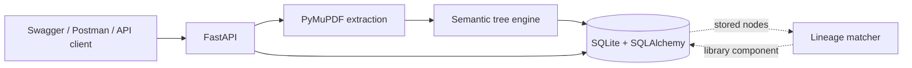
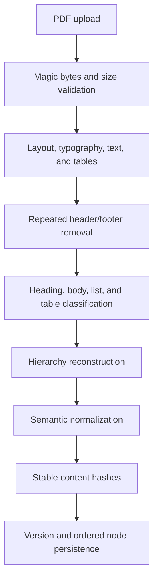
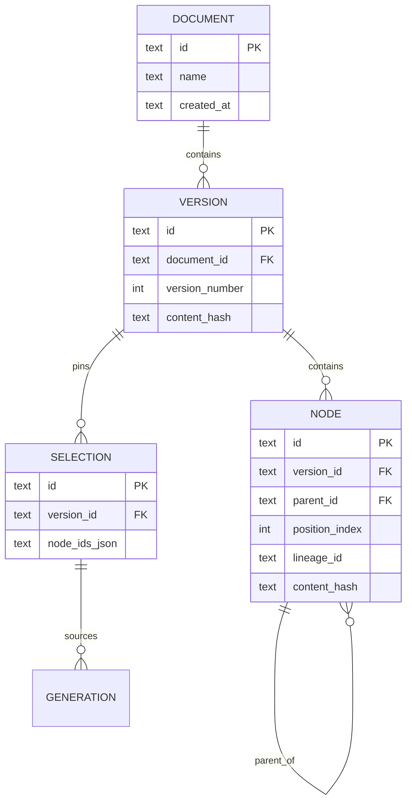

# CT200 QA Traceability

A deterministic backend for reconstructing technical PDF manuals as versioned semantic trees that can be browsed, compared, and pinned for QA workflows.


## Overview

CT200 QA Traceability accepts PDF manuals, extracts layout-aware content with PyMuPDF, reconstructs a hierarchy of semantic sections, normalizes content for stable SHA-256 hashing, and stores append-only document versions in SQLite. The service exposes a compact REST API for ingestion, ordered node browsing, lineage history, and immutable version-pinned selections.

The repository is intentionally small and reviewer-friendly: the HTTP application, domain models, persistence helpers, parser, and versioning engine are separated without repository wrappers or a layered middleware stack.

> **Current scope:** the public API supports ingestion, browsing, node history, and selection creation. NVIDIA NIM generation components and staleness-analysis code remain in the source tree, but generation, impact, and search HTTP routes are not currently exposed. Authentication and request rate limiting are also not enabled.

## Architecture





## Features

| Capability | Status | Notes |
|---|---:|---|
| PDF validation and extraction | Available | Magic-byte validation, upload limits, timeout protection, and pathological-input checks |
| Semantic hierarchy reconstruction | Available | Multi-signal heading decisions, nearest valid ancestor assignment, and no fabricated headings |
| Metadata and repeated header/footer filtering | Available | Cover-page and repeated-page content are filtered conservatively |
| Table preservation | Available | Detected tables are represented as ordered Markdown rows |
| Semantic normalization and hashing | Available | PDF wrapping and redundant spaces are normalized before SHA-256 hashing |
| Parser diagnostics | Internal | Recovery decisions are accumulated as parser warning strings; they are not yet returned by the API |
| Versioned persistence | Available | Duplicate PDF bytes are idempotent within a document; new content creates an append-only version |
| Deterministic node ordering | Available | Every stored node receives a unique `position_index` within its version |
| Node lineage matching | Library component | Exact, heading, and positional strategies are tested but are not currently orchestrated by ingestion |
| Node history endpoint | Available | Returns records sharing the selected node's `lineage_id` |
| Immutable selections | Available | Node IDs are batch-validated against a pinned version before creation |
| FTS5 storage | Foundation only | The virtual table is initialized, but indexing and a search route are not currently wired |
| NVIDIA NIM generation | Foundation only | Client, schema validation, retries, and prompt templates exist without an HTTP route |

## System Design

### Document reconstruction

The parser extracts line-level text and typography, detects tables before ordinary text extraction, removes text blocks that overlap table regions, and preserves page and bounding-box metadata. Classification combines relative font size, font weight, numbering, text length, and punctuation rather than treating numbering as sufficient evidence of a heading.

The tree engine then:

- keeps numbered list items as section body content;
- assigns each heading to the nearest valid existing ancestor;
- uses `parent.depth + 1` as structural depth;
- preserves introductory content unless it is classified as metadata;
- retains duplicate headings as distinct nodes and emits diagnostics;
- preserves table row and column order in Markdown form;
- normalizes body text before computing content hashes; and
- validates parent pointers, cycles, depth, and sibling ordering.

No missing section is synthesized. Ambiguous content is retained under the safest valid parent where possible.

### Persistence

SQLAlchemy models are consolidated in `src/ct200/database.py`. The data model is:



SQLite connections enable WAL journaling, foreign keys, a 5-second busy timeout, `synchronous=NORMAL`, and a 64 MB page cache. Node persistence uses a bulk insert, while selection validation uses one indexed `IN` query.

### Version identity

A document is currently identified by its uploaded filename. Within that document, the SHA-256 hash of the original PDF bytes makes repeated ingestion idempotent. Upload a revised file under the same multipart filename to create the next version of that document; a different filename creates a separate document record.

## Technology Stack

| Area | Technology |
|---|---|
| API | FastAPI, Uvicorn, Pydantic v2 |
| PDF intelligence | PyMuPDF (`fitz`) |
| Persistence | SQLAlchemy 2.x, SQLite, FTS5 |
| Logging | structlog |
| HTTP integration | HTTPX |
| Testing | pytest, pytest-asyncio, Hypothesis, pytest-cov |
| Quality | Ruff, Black, MyPy, pip-audit |
| Packaging | Hatchling, Docker artifacts |

## API

Start the service and open [Swagger UI](http://127.0.0.1:8000/docs) for the generated OpenAPI documentation.

| Method | Path | Purpose |
|---|---|---|
| `GET` | `/health` | Liveness check |
| `POST` | `/api/v1/documents` | Ingest a PDF from multipart field `file` |
| `GET` | `/api/v1/documents/{doc_id}/nodes` | Browse the latest or requested document version in source order |
| `GET` | `/api/v1/nodes/{node_id}/diff` | Return history for the node's lineage |
| `POST` | `/api/v1/selections` | Create an immutable selection pinned to one version |

The browse endpoint accepts an optional integer `version` query parameter. It omits the synthetic root node and returns a 200-character body preview for each stored section.

### Ingest a PDF

In Postman, choose `POST`, select **Body → form-data**, create a field named exactly `file`, change its type to **File**, and select a PDF.

```text
POST http://127.0.0.1:8000/api/v1/documents
Content-Type: multipart/form-data
field: file=<PDF>
```

Windows command-line equivalent:

```bat
curl.exe -X POST http://127.0.0.1:8000/api/v1/documents ^
  -F "file=@pdf\ct200_manual.pdf;type=application/pdf"
```

A new version returns HTTP `201`:

```json
{
  "document_id": "<document UUID>",
  "version_id": "<version UUID>",
  "version_number": 1,
  "is_new": true
}
```

Re-ingesting the same bytes under the same filename returns the existing version with HTTP `200` and `is_new: false`.

### Browse nodes

```bat
curl.exe "http://127.0.0.1:8000/api/v1/documents/<document_id>/nodes"
curl.exe "http://127.0.0.1:8000/api/v1/documents/<document_id>/nodes?version=1"
```

### Inspect lineage history

```bat
curl.exe "http://127.0.0.1:8000/api/v1/nodes/<node_id>/diff"
```

### Create a selection

Use node IDs returned by the browse endpoint and the `version_id` returned during ingestion:

```bat
curl.exe -X POST http://127.0.0.1:8000/api/v1/selections ^
  -H "Content-Type: application/json" ^
  -d "{\"version_id\":\"<version_id>\",\"node_ids\":[\"<node_id>\"],\"label\":\"Safety review\"}"
```

## Installation

### Prerequisites

- Python 3.12 or newer
- SQLite with FTS5 support (included in standard Python distributions on common platforms)
- Git

### Windows

Run from the repository directory:

```bat
python -m venv .venv
.venv\Scripts\activate
python -m pip install --upgrade pip
python -m pip install -e ".[dev]"
if not exist data mkdir data
```

### Linux or macOS

```bash
python -m venv .venv
source .venv/bin/activate
python -m pip install --upgrade pip
python -m pip install -e ".[dev]"
mkdir -p data
```

The application defaults to `sqlite:///data/ct200.db` and creates its tables and FTS5 virtual table on first database access. No API key is required for the currently exposed routes. To use another SQLite location, set `DATABASE_URL` in the process environment before startup. The application does not automatically load `.env`; `.env.example` is reference configuration for future integrations.

## Running Locally

```bat
uvicorn ct200.main:app --reload --port 8000
```

Use these local addresses:

- API base: <http://127.0.0.1:8000>
- Swagger UI: <http://127.0.0.1:8000/docs>
- Health check: <http://127.0.0.1:8000/health>

`--reload` is for development only. Omit it for a single-process local runtime.

### Container status

A multi-stage `Dockerfile` and `docker-compose.yml` are included, but the container path has not been revalidated since the architecture was flattened. Treat local Python execution as the supported path until the image build and health check are verified in CI.

## Project Structure

```text
ct200-qa-traceability/
├── src/ct200/
│   ├── main.py                 # FastAPI application and current routes
│   ├── database.py             # ORM models, engine, and persistence helpers
│   ├── models.py               # Parser, tree, and lineage domain models
│   ├── schemas.py              # API request and response schemas
│   ├── parser/                 # Extraction, cleanup, rendering, reports, tree engine
│   ├── versioning/             # Lineage matching and version diff logic
│   └── generation/             # NIM client and prompt/schema infrastructure
├── tests/                      # Parser, API, persistence, versioning, and staleness tests
├── pdf/                        # CT200 v1 and v2 benchmark fixtures
├── docs/                       # QA and performance evidence
├── alembic/                    # Initial schema migration
├── data/                       # Local SQLite runtime files
├── pyproject.toml
└── Dockerfile
```

Do not commit `.env` or runtime database files. Use `.env.example` when documenting additional configuration.

## Testing and Quality

Run the complete test suite once (non-watch mode):

```bat
pytest tests/ -q
```

The current suite contains 46 tests covering API ingestion, database behavior, idempotency, parser hardening and irregular structures, lineage matching, hash sensitivity, and staleness logic.

Run static checks independently:

```bat
ruff check src tests
black --check src tests
mypy src
pip-audit --strict --desc on
```

### Recorded performance

The following measurements are from the repository's QA benchmark report on Windows with Python 3.13.7. They are point measurements, not statistically established service-level guarantees, and predate the latest semantic parser rewrite.

| Input / operation | Recorded result |
|---|---:|
| `ct200_manual.pdf` | 6 pages, 121 extracted blocks, 316 ms parse |
| `ct200_manual_v2.pdf` | 7 pages, 131 extracted blocks, 357 ms parse |
| Tree construction | 0.3–0.4 ms in the recorded fixture |
| Four-node lineage matching | 0.1 ms |

See [`docs/QA_PERFORMANCE_REPORT.md`](docs/QA_PERFORMANCE_REPORT.md) for the test evidence, environment, and benchmark context. Re-run benchmarks before using these values for capacity planning.

## Design Decisions

- **Semantic reconstruction over raw extraction:** layout and typography inform classification, while hierarchy is validated separately.
- **No fabricated structure:** missing headings are not invented; uncertain content is retained and diagnostic warnings are emitted.
- **Normalized hashes:** hashes represent semantic heading/body content rather than incidental PDF wrapping.
- **Source-order persistence:** `position_index` is authoritative for deterministic API ordering.
- **Append-only versions:** an existing PDF-byte hash is reused; changed bytes create a new version without modifying earlier records.
- **SQLite for a focused deployment:** WAL mode and targeted indexes keep local operation simple while preserving a migration path to a server database.
- **Flat modules over ceremony:** core behavior remains discoverable without protocol, repository, or transport abstraction layers.

## Known Limitations

- The service has no authentication, authorization, request rate limiting, or TLS termination; do not expose it directly to an untrusted network.
- Generation, impact/staleness, and full-text search are not available through the current HTTP API.
- The lineage matcher is not yet called by the ingestion route, so cross-version lineage history is not automatically established.
- Parser warnings and reconciliation reports are not persisted or returned by ingestion.
- Document identity depends on the uploaded filename, not an explicit stable document key.
- Table extraction depends on detectable PDF geometry; merged cells and borderless tables may degrade to partial Markdown.
- Scanned or image-only PDFs require OCR before ingestion.
- Multi-column reading order uses geometric heuristics and can be ambiguous for highly irregular layouts.
- SQLite is suitable for local or modest single-service workloads, not high-write distributed deployment.
- Docker packaging requires a fresh validation pass after the architecture flattening.

## Future Improvements

1. Wire lineage assignment into transactional ingestion and expose reviewable low-confidence matches.
2. Return structured parser diagnostics and persist extraction reports with each version.
3. Expose scoped FTS5 search, generation, and staleness endpoints with end-to-end tests.
4. Add authentication, authorization, upload quotas, and network-layer rate limiting before deployment.
5. Add OCR and richer table-cell semantics for scanned and layout-heavy manuals.
6. Revalidate the container build and publish repeatable benchmark scenarios.

## License

No license file is currently included. Unless a license is added, the repository should not be treated as open-source or redistributed under assumed terms.
