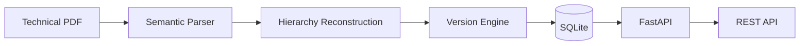

# CT200 QA Traceability

> A production-oriented backend that transforms technical PDF manuals into versioned semantic trees for deterministic QA traceability, immutable selections, and document evolution.

<p align="center">


</p>

---

## Why this project?

Most document systems extract text.

This project reconstructs **document structure**.

Instead of treating a PDF as a collection of paragraphs, CT200 identifies semantic sections, rebuilds hierarchy, versions every document, preserves lineage across revisions, and exposes a deterministic backend for QA workflows.

The repository focuses on correctness, reproducibility, and maintainability rather than feature count.

---

# Architecture



---

# Repository Highlights

| Category | Value |
|-----------|-------|
| Language | Python 3.12 |
| Framework | FastAPI |
| Database | SQLite + SQLAlchemy |
| Parser | Multi-signal semantic reconstruction |
| Versioning | Append-only |
| Hashing | Stable SHA-256 |
| Tests | 46 |
| Architecture | Modular backend |

---

# Core Capabilities

| Capability | Description |
|------------|-------------|
| Semantic Parsing | Reconstructs document hierarchy instead of extracting raw text |
| Version Engine | Immutable document versions with deterministic ordering |
| Lineage | Tracks nodes across document revisions |
| Stable Hashing | Normalized content hashing for reliable comparisons |
| Table Preservation | Retains Markdown table structure |
| REST API | Clean FastAPI endpoints |
| SQLite Persistence | Lightweight, deterministic storage |
| Parser Diagnostics | Recovery warnings for ambiguous structures |

---

# Quick Start

Clone the repository

```bash
git clone <repository-url>
cd ct200-qa-traceability
```

Install dependencies

```bash
python -m venv .venv

source .venv/bin/activate
# Windows
# .venv\Scripts\activate

pip install -e ".[dev]"
```

Run the application

```bash
uvicorn ct200.main:app --reload
```

Open Swagger

```
http://127.0.0.1:8000/docs
```

---

# API

| Method | Endpoint | Purpose |
|---------|----------|----------|
| POST | `/documents` | Upload a manual |
| GET | `/documents/{id}/nodes` | Browse semantic tree |
| GET | `/nodes/{id}/diff` | Node lineage history |
| POST | `/selections` | Create immutable QA selection |
| GET | `/health` | Health check |

---

# Parsing Pipeline

```text
PDF

↓

Layout Analysis

↓

Typography Analysis

↓

Heading Classification

↓

Hierarchy Reconstruction

↓

Normalization

↓

Stable Hashing

↓

Version Persistence

↓

REST API
```

---

# Project Structure

```text
src/
│
├── parser/
│     Semantic reconstruction engine
│
├── versioning/
│     Lineage & version comparison
│
├── generation/
│     LLM integration layer
│
├── database.py
│     SQLAlchemy models & persistence
│
├── schemas.py
│     API contracts
│
└── main.py
      FastAPI application
```

---

# Design Principles

The repository follows several engineering principles.

- Deterministic parsing
- Immutable version history
- Stable semantic hashing
- Explicit parser recovery
- No fabricated document structure
- Reviewer-friendly architecture
- Minimal dependencies
- Predictable APIs

---

# Testing

The project contains **46 automated tests** covering:

- parser correctness
- hierarchy reconstruction
- API behaviour
- database persistence
- idempotent ingestion
- lineage matching
- versioning
- hash stability

Run them with

```bash
pytest tests/
```

---

# Benchmarks

| Operation | Result |
|-----------|--------|
| PDF Parsing | ~316 ms |
| Tree Reconstruction | <1 ms |
| Lineage Matching | ~0.1 ms |
| Nodes | 20 |
| Parser Depth | 3 |

---

# Roadmap

### Near Term

- FTS5 Search
- Lineage integration
- Parser diagnostics endpoint

### Future

- OCR support
- Multi-column reconstruction
- Distributed persistence
- Authentication
- Staleness API
- NVIDIA NIM generation endpoint

---

# Known Limitations

- OCR is not supported.
- Multi-column layouts rely on geometric heuristics.
- Authentication is not yet enabled.
- SQLite is intended for local and moderate workloads.

---

# License

No license has been specified yet.
